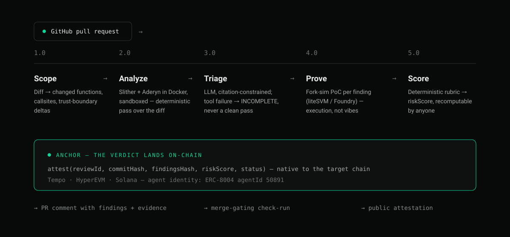

<div align="center">
  
</div>

<h1 align="center">Rextor Audit</h1>

<div align="center">

[](PLAN.md)
[](LICENSE)
[](#live-receipts)
[](packages/agent)
[](https://etherscan.io/tx/0xc4c0565c1f07e42cbd9524dadc7a033079ac0d4f7d497cb70abd7ba0dcec3d64)

</div>

**Rextor Audit** turns every pull request that touches money-code into an **audit event**: diff-scoped static analysis, fork simulation against live chain state, citation-constrained LLM triage, a deterministic risk score anyone can recompute — and the verdict **anchored on-chain, keyed to the commit**.

Built by **Rextor Security** — practicing auditors. The methodology that reviews your code is the same one we hunt bugs with.

> 🌐 Product is **live** at [www.rextoraudit.com](https://www.rextoraudit.com) — [install the app](https://www.rextoraudit.com/install) · [example dashboard](https://www.rextoraudit.com/dashboard/rextorsec/rextor-audit-test). Pre-alpha, building in the open for the Colosseum Crypto World's Fair (submissions close **Oct 12, 2026**).

## Table of contents

- [Why Rextor](#why-rextor)
- [How a PR becomes an audit event](#how-a-pr-becomes-an-audit-event)
- [Live receipts](#live-receipts)
- [Integrity rails](#integrity-rails)
- [Capability matrix](#capability-matrix)
- [Quickstart](#quickstart)
- [Repository map](#repository-map)
- [Documentation](#documentation)
- [Security](#security)
- [License](#license)

## Why Rextor

A traditional audit is a snapshot: weeks of expert review, then the code keeps changing. The riskiest window in a protocol's life — every merge after the report — runs unaudited.

Rextor closes that window. It sits in the pull-request flow, where code changes actually happen, and behaves like an auditor, not a linter: it reads the diff the way money moves through it, proves findings by executing them against forked state, refuses to guess when tooling breaks, and leaves a verdict anyone can verify on-chain — permanently.

Generic AI reviewers read code changes. **Rextor audits money changes.**

| | Point-in-time audit | Rextor (continuous) |
|---|---|---|
| Cadence | Once, at engagement | Every PR, forever |
| Method | Human expertise | Deterministic analyzers + fork-sim PoCs + cited triage |
| Verdict | PDF report | On-chain attestation, keyed to the commit |
| Recomputable | No | Yes — sha256 of the findings JSON = the on-chain `findingsHash` |

## How a PR becomes an audit event



1. **Scope (1.0)** — the diff becomes an audit surface: changed functions, new callsites, trust-boundary deltas.
2. **Analyze (2.0)** — Slither + Aderyn run in Docker over the scoped surface. Deterministic, no LLM in this stage.
3. **Triage (3.0)** — the LLM may only reclassify, dedup, or add findings **with cited line ranges**. Tool failure marks the report `INCOMPLETE` — never a fabricated clean pass.
4. **Prove (4.0)** — confirmed findings get execution-proof PoCs: fork simulation against live chain state (liteSVM / Foundry fork).
5. **Score (5.0)** — a deterministic rubric maps findings → `riskScore`. Recomputable by anyone from the findings alone; no hidden weights.

**Anchor** — the verdict is attested on the chain the code targets: `attest(reviewId, commitHash, findingsHash, riskScore, status)`. Three surfaces come out: the PR comment, a merge-gating check-run, and the public on-chain attestation.

## Live receipts

> **Receipts, not claims.** Every number below is probeable right now. Counts as of **2026-09-22**.

| Chain | Attestation contract | Receipt | Explorer |
|---|---|---|---|
| **Tempo testnet** (chain 42431) | [`0x51ac…495a`](https://explore.testnet.tempo.xyz/address/0x51ac8214089daf85b188437b087519acfc6c495a) | **5 attestations** · agent active | [explore.testnet.tempo.xyz](https://explore.testnet.tempo.xyz/address/0x51ac8214089daf85b188437b087519acfc6c495a) |
| **HyperEVM mainnet** (chain 999) | [`0x8f63…850c`](https://hyperevmscan.io/address/0x8f63c0581ab3b2836c95f97fcf104d2dd962850c) | agent active · 0 attestations | [hyperevmscan.io](https://hyperevmscan.io/address/0x8f63c0581ab3b2836c95f97fcf104d2dd962850c) |
| **Solana devnet** | [`Aj6Nx…kMDs`](https://explorer.solana.com/address/Aj6NxH8Ptjn7v3QVCZEQ9dPNWx8DjmaE2oPMNvnikMDs?cluster=devnet) | adapter live | [explorer.solana.com](https://explorer.solana.com/address/Aj6NxH8Ptjn7v3QVCZEQ9dPNWx8DjmaE2oPMNvnikMDs?cluster=devnet) |

**Agent identity** — registered on the canonical ERC-8004 registry as **agentId 50891** (`eip155:1:0x8004A169FB4a3325136EB29fA0ceB6D2e539a432`): [mint transaction](https://etherscan.io/tx/0xc4c0565c1f07e42cbd9524dadc7a033079ac0d4f7d497cb70abd7ba0dcec3d64) · [operator feedback 95/100](https://etherscan.io/tx/0x02e73670735f1097dad2b90d4b01f4755a2c16d5ef34b126e30017f40c7fb5ea) · identity URI `ipfs://QmcKWrvJvDEQinnUvUEd2v36ERF247QezssjfXEbc6QMAr`.

Anyone can verify the agent's live status — no trust in this README required:

```bash
$ curl -s https://www.rextoraudit.com/api/chain/tempo | jq
{
  "chain": "tempo",
  "name": "rextor-audit",
  "active": true,
  "reviewCount": 5
}
```

Built for the Colosseum CWF: **Tempo (flagship) + Hyperliquid (primary)** tracks, Solana adapter tier, and EVM riders (Ethereum L1 / Base / Arbitrum / Robinhood Chain) as attestation targets.

## Integrity rails

The refusals are the product:

- **`INCOMPLETE` is never silent.** Analyzer failure or timeout produces a visibly broken report — on-chain status `1`, risk score 0 that can never masquerade as a clean pass.
- **Citation-constrained triage.** The LLM cannot comment without a cited line range from the diff. No findings from thin air.
- **PR content is untrusted input.** All generated text is sanitized and rendered inert inside fenced blocks; simulations run sandboxed in Docker. Prompt injection gets nothing.
- **Deterministic rubric.** `riskScore` is a pure function of the findings — anyone can recompute it and compare with the attested value.
- **Honest degradation.** Missing IPFS pin attests an empty `findingsURI`; a degraded receipt always says what it couldn't do.

## Capability matrix

**15/15 shipped.** Source of truth: [`packages/web/content/capabilities.json`](packages/web/content/capabilities.json) — competitor marks are relative to public product pages as of 2026-09-19.

<details>
<summary><strong>All 15 rows</strong> (click to expand)</summary>

| Capability | Generic AI review | One-shot audit bots | Rextor receipt |
|---|:-:|:-:|---|
| Built for money-code — analyzer grounding | ✗ | ~ | [stage 2.0](#how-a-pr-becomes-an-audit-event) |
| Every PR an audit event (diff-scoped, continuous) | ✓ | ✗ | [stage 1.0](#how-a-pr-becomes-an-audit-event) |
| Deterministic, recomputable risk score | ✗ | ~ | [the rubric](#how-a-pr-becomes-an-audit-event) |
| Execution-proof findings (fork-sim PoC) | ✗ | ✗ | [stage 4.0](#how-a-pr-becomes-an-audit-event) |
| Verdict on-chain, native to the target chain | ✗ | ✗ | [Tempo](https://explore.testnet.tempo.xyz/address/0x51ac8214089daf85b188437b087519acfc6c495a) · [HyperEVM](https://hyperevmscan.io/address/0x8f63c0581ab3b2836c95f97fcf104d2dd962850c) · [Solana](https://explorer.solana.com/address/Aj6NxH8Ptjn7v3QVCZEQ9dPNWx8DjmaE2oPMNvnikMDs?cluster=devnet) |
| Integrity rails — INCOMPLETE never silent | ~ | ✗ | [stage 3.0](#integrity-rails) |
| Suggested fix per finding (reviewable diff) | ✓ | ✗ | smoke PR · suggested diff ¹ |
| Repo config + severity merge gate | ✗ | ✗ | smoke PR · check-run ¹ |
| Durable full report (IPFS) + anyone-can-verify | ✗ | ✗ | smoke PR · CID + on-chain hash ¹ |
| Verifiable agent identity (ERC-8004) | ✗ | ✗ | [agentId 50891 · mainnet](https://etherscan.io/tx/0xc4c0565c1f07e42cbd9524dadc7a033079ac0d4f7d497cb70abd7ba0dcec3d64) |
| Public agent reputation ledger | ✗ | ✗ | [feedback 95/100 · mainnet](https://etherscan.io/tx/0x02e73670735f1097dad2b90d4b01f4755a2c16d5ef34b126e30017f40c7fb5ea) |
| Cross-PR memory (dismissals) | ✓ | ✗ | smoke PR · learnings ledger ¹ |
| Chat in PR | ✓ | ✗ | smoke PR · bot reply ¹ |
| Chain cost-model reasoning | ✗ | ✗ | [measured: 0.0125–0.154 per attest, 6 txs](docs/e1-fee-review.md) |
| Living dashboard — ledger, history, identity | ✓ | ✗ | [live dashboard](https://www.rextoraudit.com/dashboard/rextorsec/rextor-audit-test) |

✓ yes · ~ partial · ✗ no

¹ Smoke receipts live on the private fixture repo (`rextorsec/rextor-audit-test`); the fixture PR is kept as the canonical repro.

</details>

## Quickstart

1. **Install** the GitHub App on your repo → [www.rextoraudit.com/install](https://www.rextoraudit.com/install)
2. **Open a pull request** that touches `.sol` files or an Anchor program.
3. **Read the verdict** — a PR comment with findings, evidence, and suggested diffs, plus a merge-gating check-run.

Shape of the PR comment (illustrative values; template verbatim from the bot's `summaryCommentBody`):

````markdown
## rextor audit — risk score: 87/100

> ⚖ attested on Tempo testnet · [tx `0x51ac8214…`](https://explore.testnet.tempo.xyz/tx/0x…) · verify: recompute sha256 of the findings JSON below and compare with the on-chain findingsHash.

**2 finding(s)** in changed contract code.

| # | severity | check | location | note |
| --- | --- | --- | --- | --- |
| 0 | HIGH | unchecked-send | src/Vault.sol:42 | … |

<details>
<summary>Runnable PoC — finding #0 (Foundry)</summary>

````solidity
// executable fork test proving the finding
````

</details>

<details>
<summary>Findings JSON — sha256 of this exact line (no trailing newline) = on-chain findingsHash</summary>

```json
[…]
```

</details>
````

## Repository map

```
packages/
  agent/                review engine — webhook server, diff scope, Docker analyzers,
                        fork sims, citation-constrained triage, on-chain attest (TS strict)
  web/                  Next.js surface — landing, install, dashboard, /api/chain/*
contracts/
  attestation-evm/      RextorAttestation v2 (Foundry) — Tempo + HyperEVM deploys
programs/
  attestation-solana/   Anchor program — Solana attestation
fixtures/
  vault/                deliberately-vulnerable Solidity fixture + Foundry proof
docs/                   runbooks, specs, plans, demo script
```

## Documentation

| Doc | What it covers |
|---|---|
| [SPEC.md](SPEC.md) | Product spec — the wedge, the guarantees |
| [PLAN.md](PLAN.md) | Execution plan — phases, gates, non-negotiables |
| [docs/deployments/](docs/deployments/) | Chain runbooks: Tempo · HyperEVM · Solana · ERC-8004 · key rotation |
| [docs/e1-fee-review.md](docs/e1-fee-review.md) | Real attestation costs, measured on-chain |
| [docs/competitive-positioning.md](docs/competitive-positioning.md) | Landscape and moat analysis |
| [docs/demo/script.md](docs/demo/script.md) | Demo walkthrough script |

## Security

Report vulnerabilities in Rextor Audit **privately** to **rector@rectorspace.com** — see [SECURITY.md](SECURITY.md). Do not open public issues for security reports.

## License

[MIT](LICENSE) — © 2026 Rextor Security.
